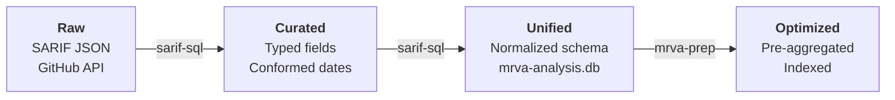

# Methodology

MRVA reporting is fundamentally a data problem. SARIF artifacts are unstructured, per-repository JSON documents that must be transformed into a queryable, presentation-ready format. The workflow follows four stages:

 
 

## 1. Raw

Input: SARIF JSON files and analysis metadata downloaded from the GitHub Code Scanning API. Each file is an independent, deeply nested document with no cross-repository linkage. This is the unprocessed source data.

## 2. Curated

The `sarif-sql` CLI parses each SARIF file and extracts typed fields: rule identifiers, severity levels, message strings, file paths, region coordinates, code flow steps, and fingerprints. Date values are conformed to a consistent format. Nested SARIF structures (runs → results → locations → code flows) are flattened into discrete records with explicit relationships.

## 3. Unified

Curated records are mapped to a normalized relational schema and written to a SQLite database (`mrva-analysis.db`). Four tables `analysis`, `repository`, `rule`, `alert` establish foreign key relationships that enable cross-repository queries. Data from all scanned repositories is consolidated into a single database, providing the unified query surface.

## 4. Optimized

The `mrva-prep` CLI restructures the database for client-side rendering performance. Pre-aggregated metrics (alert counts by severity, top rules, top repositories, file path distributions) are computed and stored. Query-optimized indexes are added to support the access patterns required by the reporting dashboard. The result is a database that can be loaded into an in-memory WASM SQLite instance and queried without perceptible latency.