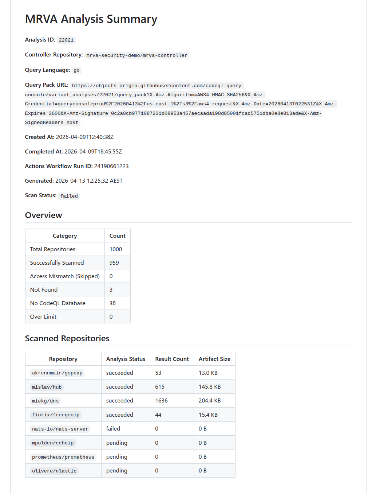
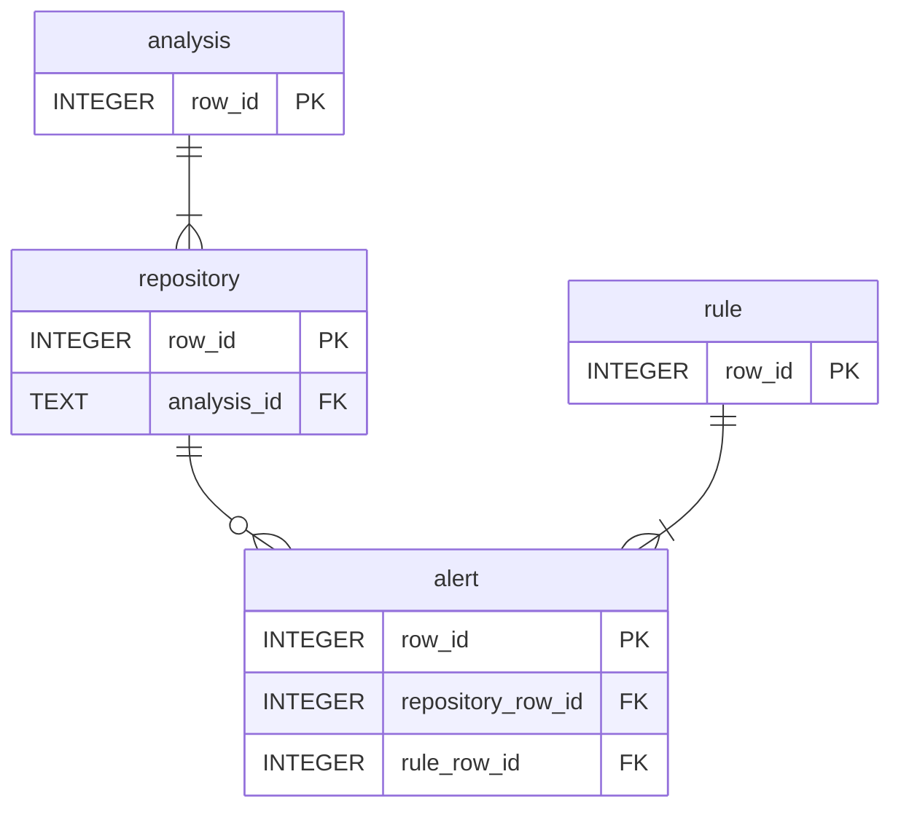

# sarif-sql

`sarif-sql` is a Go CLI that handles the curated and unified stages of the MRVA workflow. It authenticates against the GitHub API, downloads SARIF artifacts from a completed MRVA analysis, and transforms them into a normalized SQLite database.

The CLI is built with [Cobra](https://github.com/spf13/cobra), providing built-in help text, usage documentation, and flag validation for every command and subcommand. Run any command with `--help` for detailed usage.

The binary name is `sarif-sql`. The module path is `github.com/advanced-security/sarif-sql`.

## Global Flags

All commands require these persistent flags:

| Flag | Required | Description |
|------|----------|-------------|
| `--analysis-id` | Yes | The MRVA analysis ID (from the create API response). |
| `--controller-repo` | Yes | Controller repository in `owner/name` format. |

<br>
<br>

{{ #asciinema ../cast/sarif-sql-global-flags.cast }}

## Commands

### Authentication

The `analysis` subcommands require GitHub API authentication. Two methods are supported - mutually exclusive:

**Personal Access Token:**

```bash
--token "$GITHUB_TOKEN"
```

**GitHub App:**

```bash
--app-id "12345" --private-key "$(cat private-key.pem)"
```

When using GitHub App authentication, the CLI generates a JWT, discovers the installation ID, and obtains an installation access token. The token is refreshed transparently via a custom HTTP transport.

An optional `--base-url` flag overrides the GitHub API base URL (default: `https://api.github.com`) for GitHub Enterprise Server deployments.


### `analysis start`

Initializes the local directory structure for an analysis run. Creates the workspace at `./analyses/{analysisId}-{controllerRepo}/` where the controller repo name has `/` replaced with `-`.

```bash
sarif-sql analysis start \
--analysis-id 22011 \ 
--controller-repo mrva-security-demo/mrva-controller \
--token "$GITHUB_TOKEN"
```

### `analysis summary`

Fetches the current state of the analysis from the GitHub API and generates a markdown status report. Use this to check whether the analysis has completed before downloading artifacts.

```bash
sarif-sql analysis summary \
--analysis-id 22011 \
--controller-repo mrva-security-demo/mrva-controller \
--token "$GITHUB_TOKEN"
```

{{ #asciinema ../cast/sarif-sql-summary.cast }}

The report includes per-repository status (succeeded, pending, failed, canceled), result counts, artifact sizes, and counts for skipped, not found, no CodeQL DB, and over-limit repositories.

Below is an snippet of the report that was generated from running the command above.

<details>
<summary>Summary Report</summary>



</details>
  

### `analysis download`

Downloads SARIF artifacts for all scanned repositories in the analysis. Fetches the analysis summary, retrieves the artifact URL for each repository, downloads the zip archives concurrently, extracts the `.sarif` files, and removes the zip files. Also writes two metadata files: `analysis.json` and `repos.json`. They hold metadata mapped from the [summary API](https://docs.github.com/en/rest/code-scanning/code-scanning?apiVersion=2026-03-10#get-the-summary-of-a-codeql-variant-analysis) response. Only repositories with `analysis_status: succeeded` produce downloadable artifacts. Repositories that failed or were skipped are recorded in `repos.json` but no artifact download is attempted. The `--directory` flag should be the folder created in the ` sarif-sql analysis start` command. This collects all the raw data for the analysis and puts it in a central location for subsequent steps.

```bash
sarif-sql analysis download \
--analysis-id 22021 \
--controller-repo mrva-security-demo/mrva-controller \
--directory ./analyses/22021-mrva-security-demo-mrva-controller \
--token "$GITHUB_TOKEN" 
```
<br> 

| Flag | Required | Description |
|------|----------|-------------|
| `--directory` | Yes | Output directory for downloaded artifacts. |

<br>

{{ #asciinema ../cast/sarif-sql-download.cast }}

#### Concurrency

 Worker count is calculated dynamically using the following steps:

1. Start with `CPU count × 5` - the 5× multiplier accounts for I/O-bound work where goroutines spend most of their time blocked on API responses, allowing other goroutines to run.
2. Cap at the number of repositories - never spawn more workers than there are tasks.
3. Cap at 50 - hard upper bound to avoid resource exhaustion and respect GitHub API rate limits.
4. Floor at 1 - ensure at least one worker is always spawned.

For example, on an 8-core machine with 200 repositories: `min(min(8 × 5, 200), 50)` = 40 workers. On a 16-core machine: `min(min(16 × 5, 200), 50)` = 50 workers (hits the cap).

Each worker fetches per-repository status (to obtain the artifact URL), downloads the zip, and extracts the SARIF file.

#### Benchmarks

Downloading 959 repositories from an analysis. Benchmarked using [`hyperfine`](https://github.com/sharkdp/hyperfine) (local) and GitHub Actions runner logs (CI).

|  | Local | GitHub Actions |
|--|-------|----------------|
| **Wall-clock** | 57.660s ± 5.482s (mean, 3 runs) | ~23s |
| **Min / Max** | 51.343s / 61.160s | — |
| **User CPU** | 7.070s | — |
| **System CPU** | 3.606s | — |
| **Workers** | 50 (capped) | 20 (`4 vCPUs × 5`) |
| **CPU** | Intel Core Ultra 9 185H (22 threads) | 4 vCPUs |
| **RAM** | 64 GB | 16 GB |
| **OS** | Linux | Ubuntu 24.04 |
| **Region** | Local (Australia) | Azure West US 3 |

The ~47s gap between CPU time (~10.7s) and wall-clock time (~57.7s) on the local machine confirms the download is heavily network I/O-bound. The Actions runner completes 2.5× faster despite fewer CPUs and workers, likely due to lower network latency between the Azure-hosted runner and GitHub's artifact storage on AWS S3 (`us-east-1`).

### `transform`

Parses all SARIF files in a directory and writes the normalized data to a SQLite database (`mrva-analysis.db`). This is the core of the curated to unified pipeline stage.

```bash
sarif-sql transform \
--analysis-id 22021 \
--controller-repo mrva-security-demo/mrva-controller \
--sarif-directory ./analyses/22021-mrva-security-demo-mrva-controller \
--output ../mrva-reports/src/WebAssembly/wwwroot/data/
```

| Flag | Required | Default | Description |
|------|----------|---------|-------------|
| `--sarif-directory` | Yes | — | Path to the directory containing SARIF files, `analysis.json`, and `repos.json`. |
| `--output` | No | `./output` | Output directory for the SQLite database. |

<br>
<br>

{{ #asciinema ../cast/sarif-sql-transform.cast }}

<br>
<br>

#### Overview

The transform command is where the raw SARIF data produced by the download step is curated into typed, structured records and then unified into a single normalized SQLite database. This corresponds to the Raw → Curated → Unified stages described in the [methodology](ch02-01-methodology.md). The process has three phases:

1. Load metadata: reads `analysis.json` and `repos.json` from the SARIF directory (both written during the download phase) to establish the analysis context and the full list of repositories.
2. Parse and curate (Raw → Curated): scans the directory for `.sarif` files, pushes all filenames into a fully-buffered channel, and spawns a worker pool using the same sizing formula as the download step (`min(CPU×5, fileCount, 50)`, floor 1). Each worker pulls filenames from the channel, parses the raw SARIF JSON, extracts typed fields, flattens nested structures into discrete records, and feeds the curated data into a shared result collector.
3. Write to SQLite (Curated → Unified): once all workers finish, the curated records are mapped to a normalized relational schema and written to a fresh SQLite database in a single atomic transaction.

The following sections describe each component in detail, following the order data flows through the system.

#### Result Collection

As workers parse SARIF files in parallel, they need a central place to deposit their curated output. The `ResultCollector` struct serves this role. It holds the typed, flattened records that workers produce from raw SARIF JSON. It is initialized before workers start and uses fine-grained synchronization to allow safe concurrent writes without becoming a bottleneck:

| Field | Type | Sync Primitive | Purpose |
|-------|------|---------------|---------|
| `Alerts` | `[]*Alert` | `sync.Mutex` | Append-only alert collection |
| `Repositories` | `map[string]*SQLRepository` | `sync.RWMutex` | Repository lookup (pre-populated from `repos.json`) |
| `Rules` | `map[string]*Rule` | `sync.RWMutex` | Deduplicated rule registry (written by workers) |
| `alertCounter` | `int64` | `sync/atomic` | Lock-free unique alert ID generation |
| `ruleCounter` | `int64` | `sync/atomic` | Lock-free unique rule ID generation |

The repository map is read-only from the workers' perspective. It is fully populated before any worker starts. Rules and alerts, on the other hand, are written concurrently and require synchronization as described in the next section.

#### Worker Processing

Each worker pulls filenames from the shared channel and processes them independently. For every SARIF file, a worker performs the following steps at a high level:

1. Read and parse - the file is read and unmarshalled into a struct.
1. Repository resolution - the worker determines which repository the file belongs. If no provenance metadata exists, it falls back to using the raw SARIF filename as the lookup key.
1. Rule extraction - rules are deduplicated across workers using a double-checked locking pattern: first, an `RLock` checks whether the rule ID already exists in the shared map. If it does not, the worker upgrades to a full `Lock` and re-checks (another worker may have inserted the rule in the meantime). Only then does it insert the rule, using `atomic.AddInt64` to assign a globally unique numeric row ID. This ensures each CodeQL rule maps to exactly one ID regardless of how many SARIF files reference it.
1. Alert extraction - alert IDs are generated atomically. Each alert resolves its rule foreign key first from a local rule cache (fast path, no locking) and falls back to the shared `Rules` map with an `RLock` if the local cache misses. The worker also captures file path and region coordinates to extract source/sink snippets.
1. Batch append - once all alerts for a SARIF file are built, they are appended to the shared collection in a single lock acquisition per file rather than once per alert, minimizing lock contention.

If a file cannot be read or parsed, the error is logged and the worker moves on to the next file. A single malformed SARIF file does not abort the entire run.


#### SQLite Write

After all workers finish, the curated records held in the `ResultCollector` are unified into a SQLite database. The database is always created fresh - the existing file is removed before `sql.Open` is called. The driver is `modernc.org/sqlite`, a pure-Go implementation that requires no CGO dependency. Two pragmas are set on connection: `journal_mode=WAL` and `foreign_keys=ON`.

All data is written in a single atomic transaction:

```
BEGIN
  INSERT INTO analysis       (1 row, direct exec)
  INSERT INTO repository     (N rows, prepared statement)
  INSERT INTO rule           (M rows, prepared statement)
  INSERT INTO alert          (K rows, prepared statement)
COMMIT
```

This is an all-or-nothing operation: if any insert fails, a deferred `tx.Rollback()` fires and the database remains empty. Either the complete analysis lands or nothing does. 

#### Benchmarks

Transforming 959 SARIF files into a single SQLite database. Benchmarked using [`hyperfine`](https://github.com/sharkdp/hyperfine) (local) and GitHub Actions runner logs (CI).

|  | Local | GitHub Actions |
|--|-------|----------------|
| **Wall-clock** | 17.351s ± 0.612s (mean, 3 runs) | ~67s |
| **Min / Max** | 16.732s / 17.956s | — |
| **User CPU** | 131.352s | — |
| **System CPU** | 9.398s | — |
| **Workers** | 20 | 20 (`4 vCPUs × 5`) |
| **CPU** | Intel Core Ultra 9 185H (22 threads) | 4 vCPUs |
| **RAM** | 64 GB | 16 GB |
| **OS** | Linux | Ubuntu 24.04 |
| **Region** | Local (Australia) | Azure West US 3 |

The user CPU time (~131s) being ~7.5× the wall-clock time (~17s) on the local machine confirms the transform is effectively parallelised across available cores. The workload is CPU-bound, parsing SARIF JSON and inserting into SQLite. rather than I/O-bound. The Actions runner takes ~4× longer, reflecting the difference between 22 hardware threads and 4 vCPUs for a compute-heavy workload.

## Database Schema

The output database `mrva-analysis.db` contains four tables with foreign key relationships:



### `analysis`

| Column | Type | Source |
|--------|------|--------|
| `row_id` | INTEGER PK | Auto-generated sequential counter (`atomic.AddInt64`). |
| `tool_name` | TEXT | Hardcoded `"CodeQL"`. |
| `tool_version` | TEXT | `runs[0].tool.driver.semanticVersion` (nullable). |
| `analysis_id` | TEXT | CLI flag `--analysis-id`. |
| `controller_repo` | TEXT | CLI flag `--controller-repo`. |
| `date` | TEXT | `time.Now()` at transformation time |
| `state` | TEXT | Summary API response `.status`. |
| `query_language` | TEXT | Summary API response `.query_language`. |
| `created_at` | TEXT | Summary API response `.created_at`. |
| `completed_at` | TEXT | Summary API response `.completed_at` (nullable). |
| `status` | TEXT | Summary API response `.status`. |
| `failure_reason` | TEXT | Summary API response `.failure_reason` (nullable). |
| `scanned_repos_count` | INTEGER | `len(summary.scanned_repositories)`. |
| `skipped_repos_count` | INTEGER | `summary.skipped_repositories.access_mismatch_repos.repository_count`. |
| `not_found_repos_count` | INTEGER | `summary.skipped_repositories.not_found_repos.repository_count`. |
| `no_codeql_db_repos_count` | INTEGER | `summary.skipped_repositories.no_codeql_db_repos.repository_count`. |
| `over_limit_repos_count` | INTEGER | `summary.skipped_repositories.over_limit_repos.repository_count`. |
| `actions_workflow_run_id` | INTEGER | Summary API response `.actions_workflow_run_id`. |
| `total_repos_count` | INTEGER | Computed sum of all repository category counts. |

### `repository`

| Column | Type | Source |
|--------|------|--------|
| `row_id` | INTEGER PK | Auto-generated sequential counter (`atomic.AddInt64`). |
| `repository_full_name` | TEXT | Summary API response `.scanned_repositories[].repository.full_name` or skipped repository name. |
| `repository_url` | TEXT | Derived: `"https://github.com/" + full_name`. |
| `analysis_status` | TEXT | `scanned_repositories[].analysis_status`, or `"access_mismatch"`, `"not_found"`, `"no_codeql_db"`, `"over_limit"` for skipped repos. |
| `result_count` | INTEGER | `scanned_repositories[].result_count` (nullable — only scanned repos). |
| `artifact_size_in_bytes` | INTEGER | `scanned_repositories[].artifact_size_in_bytes` (nullable;only scanned repos). |
| `analysis_id` | TEXT | CLI flag `--analysis-id`. |

### `rule`

| Column | Type | Source |
|--------|------|--------|
| `row_id` | INTEGER PK | Auto-generated sequential counter (`atomic.AddInt64`), deduplicated across workers via double-checked locking. |
| `id` | TEXT | `runs[].tool.driver.rules[].id`. |
| `rule_name` | TEXT | `runs[].tool.driver.rules[].name`. |
| `rule_description` | TEXT | `runs[].tool.driver.rules[].properties.description` (nullable). |
| `property_tags` | TEXT | `runs[].tool.driver.rules[].properties.tags` - joined with `,` (nullable). |
| `kind` | TEXT | `runs[].tool.driver.rules[].properties.kind`. |
| `severity_level` | TEXT | `runs[].tool.driver.rules[].properties["problem.severity"]` (nullable). |

### `alert`

| Column | Type | Source |
|--------|------|--------|
| `row_id` | INTEGER PK | Auto-generated sequential counter (`atomic.AddInt64`). |
| `file_path` | TEXT | `runs[].results[].locations[0].physicalLocation.artifactLocation.uri`. |
| `start_line` | INTEGER | `runs[].results[].locations[0].physicalLocation.region.startLine` (nullable). |
| `start_column` | INTEGER | `runs[].results[].locations[0].physicalLocation.region.startColumn` (nullable). |
| `end_line` | INTEGER | `runs[].results[].locations[0].physicalLocation.region.endLine`, falls back to `startLine` (nullable). |
| `end_column` | INTEGER | `runs[].results[].locations[0].physicalLocation.region.endColumn` (nullable). |
| `code_snippet_source` | TEXT | `runs[].results[].codeFlows[0].threadFlows[0].locations[]` - snippet from the location where `taxa[0].properties["CodeQL/DataflowRole"]` is `"source"` (nullable). |
| `code_snippet_sink` | TEXT | Same as above but where `DataflowRole` is `"sink"` (nullable). |
| `code_snippet` | TEXT | Extracted from `contextRegion.snippet.text` using `region` start/end line and column coordinates (nullable). |
| `code_snippet_context` | TEXT | `runs[].results[].locations[0].physicalLocation.contextRegion.snippet.text` (nullable). |
| `message` | TEXT | `runs[].results[].message.text`. |
| `result_fingerprint` | TEXT | `runs[].results[].partialFingerprints["primaryLocationLineHash"]` (nullable). |
| `step_count` | INTEGER | `len(codeFlows[0].threadFlows[0].locations)` (nullable). |
| `repository_row_id` | INTEGER FK | Resolved via `versionControlProvenance[0].repositoryUri` → lookup in pre-loaded repository map → `repository.row_id`. |
| `rule_row_id` | INTEGER FK | Resolved via `results[].ruleId` → lookup in deduplicated rule map → `rule.row_id`. |

