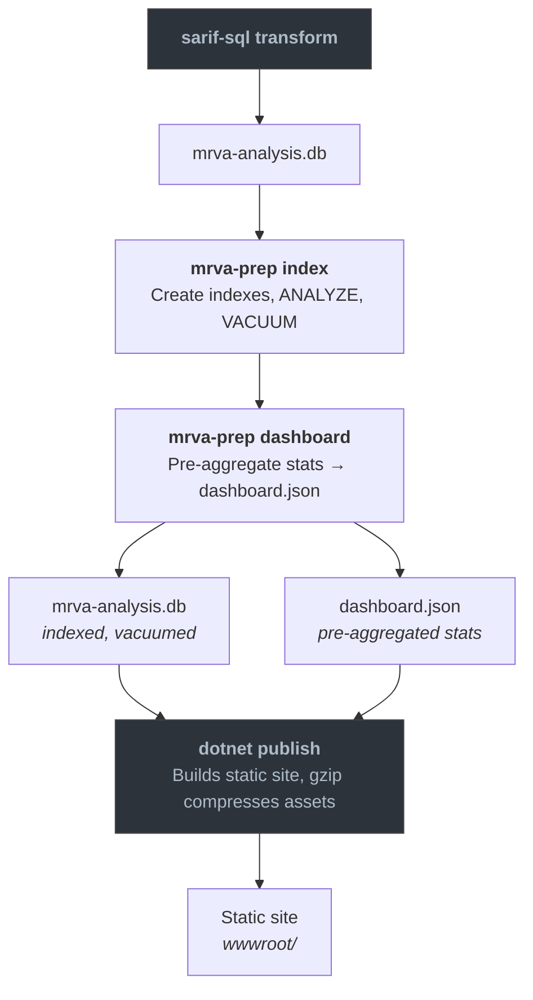

# mrva-prep

`mrva-prep` is a Go CLI that handles the optimized stage of the MRVA workflow. It takes the unified SQLite database produced by `sarif-sql transform` and prepares it for the Blazor WebAssembly reporting UI: adding query-optimized indexes, extracting pre-aggregated dashboard statistics into a lightweight JSON file, and gzip-compressing the database for local testing of browser delivery.

The CLI is built with [Cobra](https://github.com/spf13/cobra), providing built-in help text, usage documentation, and flag validation for every command and subcommand. Run any command with `--help` for detailed usage.

The binary name is `mrva-prep`. The module path is `github.com/advanced-security/mrva-prep`.

## Global Flags

All commands share this persistent flag:

| Flag | Default | Description |
|------|---------|-------------|
| `--db`, `-d` | `mrva.db` | Path to the SQLite database. |

## Commands

### `index`

Creates indexes that match the query patterns used by the Blazor WebAssembly UI. These indexes are pre-built so the browser does not need to scan full tables at runtime.

```bash
mrva-prep index --db src/WebAssembly/wwwroot/data/mrva-analysis.db
```

Two indexes are created:

| Index | Table | Column | Purpose |
|-------|-------|--------|---------|
| `idx_alert_rule_row_id` | `alert` | `rule_row_id` | Accelerates joins from alerts to rules (severity lookups, rule-grouped counts). |
| `idx_alert_repository_row_id` | `alert` | `repository_row_id` | Accelerates joins from alerts to repositories (per-repo alert counts, repository-scoped queries). |

After creating the indexes, the command runs `ANALYZE` to update SQLite's query planner statistics, then `VACUUM` to reclaim unused space and defragment the database file. This ensures the query planner has accurate cardinality estimates and the file is as compact as possible before compression.

### `dashboard`

Runs the same aggregation queries that the Blazor WASM UI executes at startup and writes the results to a lightweight JSON file (`dashboard.json`). The UI can fetch this file instantly while the full database downloads in the background, giving the user an immediate first-paint of the dashboard rather than waiting for the full database load.

```bash
mrva-prep dashboard \
  --db src/WebAssembly/wwwroot/data/mrva-analysis.db \
  --output src/WebAssembly/wwwroot/data
```

| Flag | Default | Description |
|------|---------|-------------|
| `--output`, `-o` | `.` | Directory to write `dashboard.json` into. |

The command opens the database in read-only mode (`?mode=ro`) and executes five aggregation queries:

| Query | Output Field | Description |
|-------|-------------|-------------|
| Scalar counts | `alertCount`, `repositoryCount`, `ruleCount`, `reposWithAlerts`, `rulesWithAlerts` | Single-row query computing total alerts, repositories, rules, and distinct counts of repositories and rules that have at least one alert. |
| Severity counts | `severityCounts` | Groups alerts by `rule.severity_level`, producing a label/count pair for each severity. Unknown or null severities are coalesced to `"unknown"`. |
| Top rules | `topRules` | Top 10 rules by alert count, joining `alert` to `rule` and grouping by `rule.id`. |
| Top repositories | `topRepositories` | Top 10 repositories by alert count, joining `alert` to `repository` and grouping by `repository_row_id`. |
| Top file paths | `topFilePaths` | Top 10 file path / repository combinations by alert count, excluding null or empty file paths. |

A single `analysis` row is also read from the database and included in the output, carrying all metadata fields (tool version, query language, timestamps, repository category counts, and the Actions workflow run ID).

#### Output Structure

The resulting `dashboard.json` contains the complete `DashboardStats` structure:

```json
{
  "alertCount": 1727973,
  "repositoryCount": 1000,
  "ruleCount": 8,
  "reposWithAlerts": 909,
  "rulesWithAlerts": 8,
  "analysis": {
    "analysisId": "21379",
    "controllerRepo": "mrva-security-demo/mrva-controller",
    "queryLanguage": "go",
    "status": "succeeded",
    "scannedReposCount": 909,
    "totalReposCount": 1000
  },
  "severityCounts": [ ... ],
  "topRules": [ ... ],
  "topRepositories": [ ... ],
  "topFilePaths": [ ... ]
}
```

### `compress`

Creates a gzip-compressed copy of the SQLite database using maximum compression (gzip level 9) for local testing of the `mrva-reports` solution. The Blazor WASM UI fetches the compressed file and decompresses it client-side via the browser's native `DecompressionStream` API. The original uncompressed database is left in place. This is not required for production - the `dotnet publish` step handles compression. This command exists for local testing only.

```bash
mrva-prep compress --db src/WebAssembly/wwwroot/data/mrva-analysis.db
```

The output file is written to the same path with a `.gz` suffix appended (e.g., `mrva-analysis.db.gz`). After compression, the command reports the compression ratio as a percentage of the original file size.

### `all`

Convenience command that runs all three preparation steps in sequence: `index`, `dashboard`, and `compress`. Equivalent to running each command individually.

```bash
mrva-prep all \
  --db src/WebAssembly/wwwroot/data/mrva-analysis.db \
  --output src/WebAssembly/wwwroot/data
```

| Flag | Default | Description |
|------|---------|-------------|
| `--output`, `-o` | `.` | Directory to write `dashboard.json` into (passed to the `dashboard` step). |

The command prints progress headers (`step 1/3`, `step 2/3`, `step 3/3`) as each step begins.


The `cmd/` layer handles argument parsing and database connection setup. Business logic lives in `internal/`, split into domain-specific service packages. The `models` package defines the shared data types serialized to JSON by the dashboard command.


## Pipeline Position

`mrva-prep` sits between `sarif-sql` (which produces the unified database) and the Blazor WebAssembly report (which consumes it). In the CI pipeline, `index` and `dashboard` run in sequence after the `sarif-sql transform` step and before the `dotnet publish` step that builds the report. The `compress` command is not part of the CI pipeline — `dotnet publish` handles gzip compression during the static site build. `compress` exists only for local development, where there is no publish step and the developer needs a `.gz` file to test the Blazor WASM UI's `DecompressionStream` path.



The `dashboard.json` and `mrva-analysis.db` files are placed into the Blazor app's `wwwroot/data/` directory before the .NET build. At runtime, the browser fetches `dashboard.json` first for instant rendering, then streams and decompresses the gzip-compressed database in the background to enable full interactive querying.
