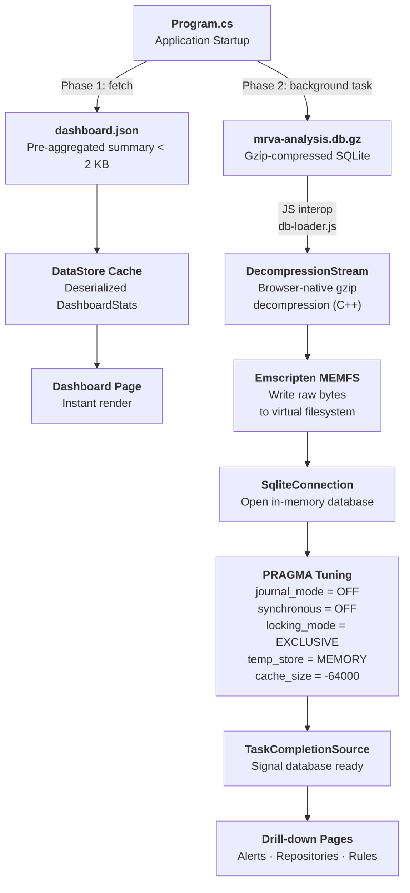

# mrva-reports

`mrva-reports` is a Blazor WebAssembly application that renders MRVA analysis results as a static, interactive single-page dashboard. It consumes the SQLite database produced by `sarif-sql` and the optimizations generated by `mrva-prep`, providing searchable alerts, severity breakdowns, repository coverage views, and rule-level drill-downs - all running entirely in the browser with no backend server.

The solution is deployed to GitHub Pages via a GitHub Actions workflow that orchestrates the full pipeline: downloading SARIF data, transforming it to SQLite, preparing indexes and dashboard metrics, compiling the Blazor WASM app with AOT, and publishing the static output.

The solution file is `MRVA.Reports.slnx`. The repository is `github.com/advanced-security/mrva-reports`.

## Why .NET and not JavaScript

The npm ecosystem carries a high supply-chain risk surface. Transitive dependency trees in JavaScript projects routinely number in the hundreds, each a potential vector for compromise. Choosing .NET eliminates this class of maintenance burden, the dependency graph is shallow (three NuGet packages), and the framework ships as a single versioned SDK with long-term support. Blazor WebAssembly also provides a natural fit for the SQLite-in-browser architecture: `Microsoft.Data.Sqlite` runs on Emscripten MEMFS, and a small JavaScript interop module (`db-loader.js`) bridges the browser's native `DecompressionStream` API for gzip decompression before handing the raw bytes to .NET. This is the only JavaScript in the solution, a single dependency-free ES module with no npm packages, no bundler, and no `node_modules`.

## Solution Structure

The solution contains two projects:

| Project | Assembly | Description |
|---------|----------|-------------|
| `src/Data` | `MRVA.Reports.Data` | Data access layer. Models, SQLite queries, and the `DataStore` service. |
| `src/WebAssembly` | `MRVA.Reports.WebAssembly` | Blazor WebAssembly host. Pages, layout, routing, and static assets. |


## Technology Stack

| Technology | Version | Purpose |
|------------|---------|---------|
| .NET | 10.0 | Runtime and SDK |
| Blazor WebAssembly | 10.0 | Client-side SPA framework |
| MudBlazor | 8.x | Material Design component library (data grids, charts, dialogs, navigation) |
| Microsoft.Data.Sqlite | 10.0 | ADO.NET provider for SQLite, runs on Emscripten MEMFS in WASM |
| AOT Compilation | — | `RunAOTCompilation` enabled for near-native query performance in the browser |

## Architecture

### Two-Phase Loading

The application uses a two-phase loading strategy to provide an instant first-paint of the dashboard while the full SQLite database downloads in the background.

**Phase 1: Instant dashboard.** 

At startup, the application fetches `dashboard.json` (< 2 KB), a pre-aggregated summary generated by `mrva-prep dashboard`. This is deserialized into a cached record and the dashboard page renders immediately without waiting for the database.

**Phase 2: Background database load.**

 A background task downloads the gzip-compressed SQLite database (`mrva-analysis.db.gz`), decompresses it using the browser's native `DecompressionStream` API via a JavaScript interop module (`db-loader.js`), and writes the raw bytes to Emscripten MEMFS. A `SqliteConnection` is opened with read-optimized PRAGMAs (`journal_mode = OFF`, `synchronous = OFF`, `locking_mode = EXCLUSIVE`, `temp_store = MEMORY`, `cache_size = -64000`), and a `TaskCompletionSource` signals readiness. Drill-down pages await this signal before querying.



### JavaScript Interop - `db-loader.js`

A single ES module (`db-loader.js`) handles fetching and decompressing the gzip-compressed SQLite database. It is invoked from .NET via `IJSRuntime` so that decompression runs through the browser's native `DecompressionStream` API  backed by the engine's built-in C++ zlib rather than .NET's `GZipStream` running as WebAssembly. The module also detects whether the browser has already transparently decompressed the response (via `Content-Encoding`) by checking the gzip magic number, and skips the decompression step if so.

### SPA Routing on GitHub Pages

GitHub Pages does not support server-side URL rewriting. Two scripts handle client-side routing:

1. **`404.html`** - GitHub Pages serves this for any unknown path. The script encodes the current path into a query parameter and redirects to the root, preserving the route.
2. **`index.html`** -  On load, a script decodes the query parameter and calls `window.history.replaceState` to restore the original URL before Blazor's router processes it.

This pattern is based on [spa-github-pages](https://github.com/rafgraph/spa-github-pages).

## Data Project - `MRVA.Reports.Data`

### Dependencies

| Package | Purpose |
|---------|---------|
| `Microsoft.Data.Sqlite` | SQLite ADO.NET provider. Runs on Emscripten MEMFS when compiled to WASM. |
| `Microsoft.Extensions.DependencyInjection` | Service registration via `AddReportData()` extension method. |

### Models

Four record types `Analysis`, `Repository`, `Rule`, and `Alert` map directly to the SQLite tables produced by `sarif-sql transform`. Each record carries the full set of columns from its corresponding table.

### DataStore Service

`DataStore` is registered as a singleton via `ServiceCollectionExtension.AddReportData()`. It manages the SQLite connection lifecycle, provides query methods for each page, and implements aggressive caching since the database is read-only.

#### Caching Strategy

The database is immutable once loaded. `DataStore` caches results at multiple levels:

| Cache | Scope | Purpose |
|-------|-------|---------|
| `_cachedDashboardStats` | Global | Dashboard metrics — computed once via JSON or a multi-result-set SQL query. |
| `_cachedAllRepoDetails` | Global | All repositories with alert counts — pre-computed with a subquery, filtered in memory. |
| `_cachedAllRuleDetails` | Global | All rules with alert counts — same pattern as repositories. |
| `_alertHeaderPageCache` | Per `(page, pageSize, search)` | Lightweight alert grid rows — cached per pagination/search key. |

####  Search

All data grids support free-text search. The alerts grid uses server-side search via a `LIKE` filter across rule ID, rule kind, repository name, severity, file path, and message columns — user input is escaped to prevent unintended wildcard matching, and large text columns (code snippets, fingerprints) are excluded for performance. The repositories and rules grids use client-side quick filtering, matching the search term against all visible columns in memory.

## WebAssembly Project - `MRVA.Reports.WebAssembly`

### Dependencies

| Package | Purpose |
|---------|---------|
| `Microsoft.AspNetCore.Components.WebAssembly` | Blazor WASM host. |
| `Microsoft.AspNetCore.Components.WebAssembly.DevServer` | Development server (private). |
| `MudBlazor` | Material Design component library. |
| `MRVA.Reports.Data` | Project reference to the data layer. |

### Pages

#### Dashboard (`/`)

The landing page. Renders immediately from the cached `DashboardStats` (Phase 1 data) without waiting for the database. Displays:

- Analysis metadata: ID, date, start/end times, tool name, controller repo, query language, state, status, failure reason, workflow run ID.
- Repository breakdown: Clickable cards for total, scanned, skipped, not found, no CodeQL DB, and over limit counts. Each navigates to the repositories page with a status filter.
- Summary cards: Total alerts, repositories, and rules. Each card navigates to its respective list page.
- Severity pie chart: Alert distribution by severity level. Clicking a slice navigates to the alerts page filtered by that severity.
- Top rules table: Top 10 rules by alert count. Clicking a row navigates to alerts filtered by rule.
- Coverage pie charts: Repository alert coverage (with/without alerts) and rule alert coverage.
- Top repositories table: Top 10 repositories by alert count.
- Top file paths table: Top 10 file path / repository combinations by alert count.

<div style="width:70vw; margin-left:calc(50% - 35vw);">
<video src="../videos/dashboard.mp4" autoplay loop muted playsinline style="width:100%"></video>
</div>

#### Alerts (`/alert`)

A server-side paginated data grid displaying all alerts. Columns: Rule, Kind, Repository, Severity, File Path. Supports free-text search with debounce (800 ms). Waits for the database to finish loading before querying. Clicking a row opens a dialog with the full alert detail (location, message, code snippets, metadata) fetched on demand. Accepts a `?search=` query parameter for cross-page navigation from the dashboard.

<div style="width:70vw; margin-left:calc(50% - 35vw);">
<video src="../videos/alerts.mp4" autoplay loop muted playsinline style="width:100%"></video>
</div>


#### Repositories (`/repo`)

A client-side data grid displaying all repositories with alert counts. Columns: Name, URL, Status, Alerts. Supports client-side quick filter search. Accepts `?hasAlerts=true|false` and `?status=<value>` query parameters for filtering from the dashboard. Page size auto-adjusts based on the total row count.

<div style="width:70vw; margin-left:calc(50% - 35vw);">
<video src="../videos/repositories.mp4" autoplay loop muted playsinline style="width:100%"></video>
</div>

#### Rules (`/rule`)

A client-side data grid displaying all rules with alert counts. Columns: ID, Description, Severity, Kind, Property Tags, Alerts. Supports client-side quick filter search across all fields including property tags. Accepts `?hasAlerts=true|false` for filtering. Double-clicking a row navigates to the rule detail page.

<div style="width:70vw; margin-left:calc(50% - 35vw);">
<video src="../videos/rules.mp4" autoplay loop muted playsinline style="width:100%"></video>
</div>


## Deployment

### Publish Pipeline

The `dotnet publish` step compiles the Blazor WASM app with AOT (`RunAOTCompilation` is enabled in the project file). A custom MSBuild target (`CompressDatabase`) runs after publish and gzip-compresses the SQLite database at `$(PublishDir)wwwroot/data/mrva-analysis.db` using `gzip -9`, then removes the uncompressed original. The app fetches the `.gz` file and decompresses client-side, so no server-side `Content-Encoding` support is needed.

### Local Development

For local development, use the standard `dotnet run` command from the WebAssembly project directory. The database file (`mrva-analysis.db`) and `dashboard.json` must be present in `src/WebAssembly/wwwroot/data/`. Use `mrva-prep compress` to create the `.gz` file for local testing of the compressed loading path.

```bash
dotnet run --project src/WebAssembly/WebAssembly.csproj
```
