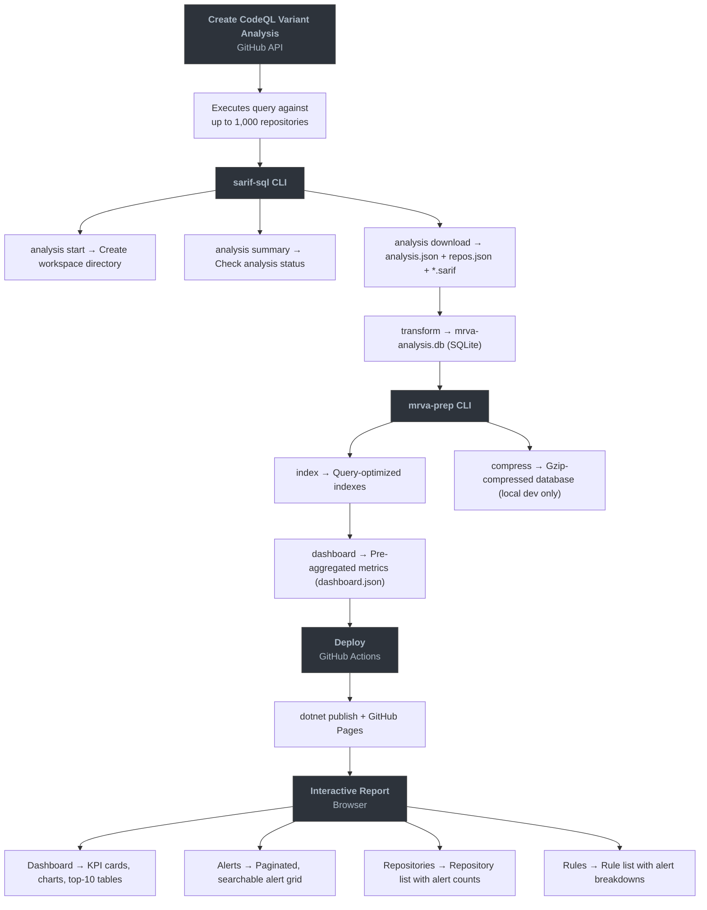

# User Manual

This manual covers the end-to-end workflow for running a Multi-Repository Variant Analysis (MRVA), transforming the results into a queryable database, and deploying an interactive report.

## MRVA Workflow

1. **Create an MRVA analysis** - submit a CodeQL query pack to the GitHub API, targeting up to 1,000 repositories in a single operation.
2. **Download and transform** - use the `sarif-sql` CLI to retrieve SARIF artifacts and normalize them into a SQLite database.
3. **Prepare the report** - use the `mrva-prep` CLI to add indexes, pre-aggregate dashboard metrics, and compress the database.
4. **Deploy** - publish an interactive Blazor WebAssembly dashboard to GitHub Pages via a GitHub Actions workflow.
5. **Navigate the report** - explore alerts, repositories, rules, and severity breakdowns in the browser.

Each step can be run independently, but the typical flow proceeds in order. A fully automated CI/CD workflow is also provided that chains steps 2–4 into a single dispatch.

## Workflow Overview

